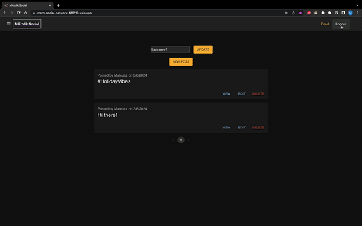
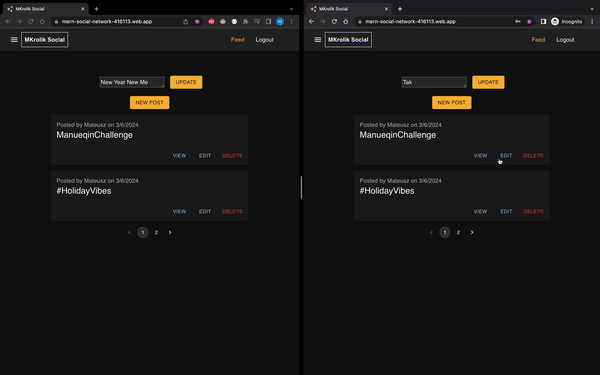
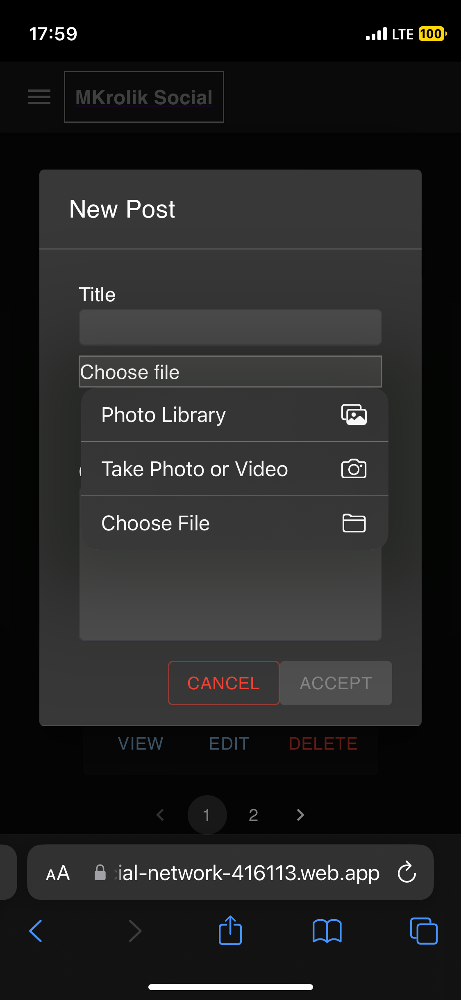
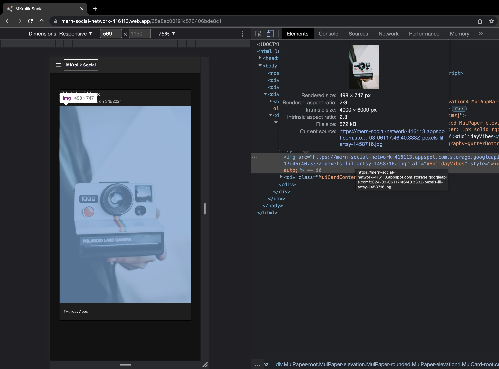
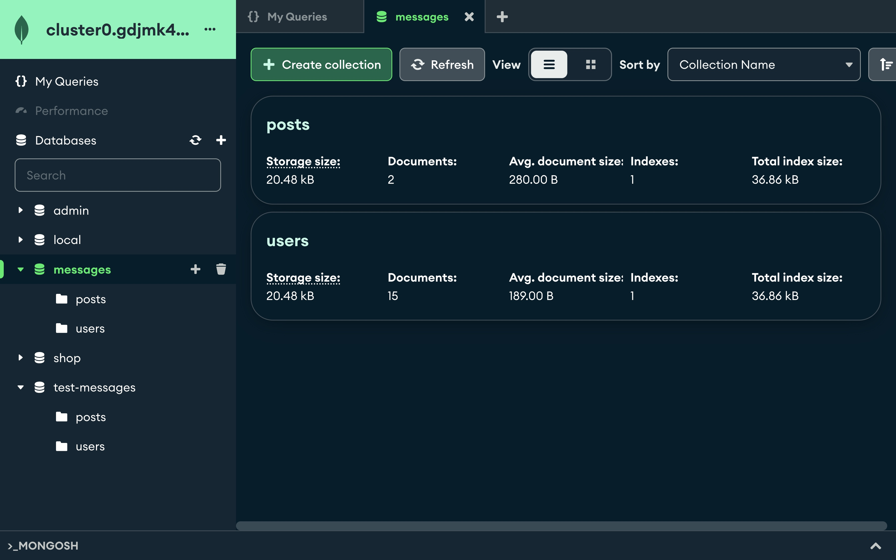

<a name="readme-top"></a>

[![Contributors][contributors-shield]][contributors-url]
[![Forks][forks-shield]][forks-url]
[![Stargazers][stars-shield]][stars-url]
[![Issues][issues-shield]][issues-url]
[![MIT License][license-shield]][license-url]
[![LinkedIn][linkedin-shield]][linkedin-url]

<!-- PROJECT LOGO -->
<br />
<div align="center">
  <a href="https://github.com/MateuszKrolik/MERN_Social_Network">
    
  </a>

<h3 align="center">RealTime Social Network</h3>
  <p align="center">
    <br />
    <a href="https://github.com/MateuszKrolik/MERN_Social_Network"><strong>Explore the docs »</strong></a>
    <br />
    <br />
    <a href="https://github.com/MateuszKrolik/MERN_Social_Network">View Demo</a>
    ·
    <a href="https://github.com/MateuszKrolik/MERN_Social_Network/issues">Report Bug</a>
    ·
    <a href="https://github.com/MateuszKrolik/MERN_Social_Network/issues">Request Feature</a>
  </p>
</div>

<!-- TABLE OF CONTENTS -->
<details>
  <summary>Table of Contents</summary>
  <ol>
    <li>
      <a href="#about-the-project">About The Project</a>
      <ul>
        <li><a href="#built-with">Built With</a></li>
      </ul>
    </li>
    <li>
      <a href="#getting-started">Getting Started</a>
      <ul>
        <li><a href="#prerequisites">Prerequisites</a></li>
        <li><a href="#installation">Installation</a></li>
      </ul>
    </li>
    <li><a href="#usage">Usage</a></li>
    <li><a href="#roadmap">Roadmap</a></li>
    <li><a href="#contributing">Contributing</a></li>
    <li><a href="#license">License</a></li>
    <li><a href="#contact">Contact</a></li>
    <li><a href="#acknowledgments">Acknowledgments</a></li>
  </ol>
</details>

<!-- ABOUT THE PROJECT -->

## About The Project

[![Product Name Screen Shot][product-screenshot]](https://mern-social-network-416113.web.app/)

<p align="right">(<a href="#readme-top">back to top</a>)</p>

### Built With

-   [![Express.js][Express.js]][Express-url]
-   [![Node.js][Node.js]][Node-url]
-   [![JavaScript][JavaScript]][JavaScript-url]
-   [![TypeScript][TypeScript]][TypeScript-url]
-   [![NodeMon][NodeMon]][NodeMon-url]
-   [![NPM][NPM]][NPM-url]
-   [![MongoDB][MongoDB]][MongoDB-url]
-   [![Mongoose][Mongoose]][Mongoose-url]
-   [![Socket.IO][Socket.IO]][Socket.IO-url]
-   [![JSON Web Tokens][JSON Web Tokens]][JSON Web Tokens-url]
-   [![Docker][Docker]][Docker-url]
-   [![Linux/Unix][Linux/Unix]][Linux/Unix-url]
-   [![Bash][Bash]][Bash-url]
-   [![React][React]][React-url]
-   [![React Router][React Router]][React Router-url]
-   [![Axios][Axios]][Axios-url]
-   [![Material-UI][Material-UI]][Material-UI-url]
-   [![HTML5][HTML5]][HTML5-url]
-   [![CSS3][CSS3]][CSS3-url]
-   [![Webpack][Webpack]][Webpack-url]
-   [![Google Cloud Platform][Google Cloud Platform]][Google Cloud Platform-url]
-   [![GCP App Engine Flexible][GCP App Engine Flexible]][GCP App Engine Flexible-url]
-   [![Google Cloud Storage][Google Cloud Storage]][Google Cloud Storage-url]
-   [![Firebase Static Hosting][Firebase Static Hosting]][Firebase Static Hosting-url]
-   [![Postman][Postman]][Postman-url]
-   [![Mocha.js][Mocha.js]][Mocha.js-url]
-   [![Chai.js][Chai.js]][Chai.js-url]
-   [![Sinon.js][Sinon.js]][Sinon.js-url]
<p align="right">(<a href="#readme-top">back to top</a>)</p>

<!-- GETTING STARTED -->

## Getting Started

As a prerequisite i recommend having Node.js and NPM installed, as well as Docker for Desktop.

For a Smooth DataBase management also consider using MongoDB Compass.

### Prerequisites

This is a list of things you need to use the software and how to install them.

-   npm
    ```sh
    npm install npm@latest -g
    ```

### Installation

1. Clone the repo
    ```sh
    git clone https://github.com/MateuszKrolik/MERN_Social_Network.git
    ```
2. Install NPM packages
    ```sh
    npm install
    ```
3. Enter your environment variables in `.env`, `nodemon.json` and `app.yaml`.
    ```js
    MONGO_USER = "ENTER YOUR MONGO_USER";
    MONGO_PASSWORD = "ENTER YOUR MONGO_PASSWORD";
    MONGO_DEFAULT_DATABASE = "ENTER YOUR MONGO_DEFAULT_DATABASE";
    MONGO_DEFAULT_TEST_DATABASE = "ENTER YOUR MONGO_DEFAULT_TEST_DATABASE";
    JWT_SECRET = "ENTER YOUR JWT_SECRET";
    ```

<p align="right">(<a href="#readme-top">back to top</a>)</p>

<!-- USAGE EXAMPLES -->

## Usage

_Below you'll find visual usage example representation if form of screenshots.
To test these out yourself visit this [Link](https://mern-social-network-416113.web.app/) 😉_

<div align="center">
  <a href="https://mern-social-network-416113.web.app/signup">
    
  </a>

https://github.com/MateuszKrolik/MERN_Social_Network/assets/127691471/cd522993-ed44-414b-9669-f8a3b7a327ee

  <a href="https://mern-social-network-416113.web.app/">
    
  </a>
  <a href="https://mern-social-network-416113.web.app/">
    
  </a>
  <a href="https://mern-social-network-416113.web.app/">
    
  </a>  
  <a href="https://mern-social-network-416113.web.app/">
    
  </a>    
</div>

<p align="right">(<a href="#readme-top">back to top</a>)</p>

<!-- ROADMAP -->

## Roadmap

-   [x] Backend REST API via Node.js Framework(Express.js)
-   [x] Frontend Reactive Single-Page-App(SPA) - React & ReactRouter@6.4 Libraries
-   [x] Monolithic Architecture: Model-View-Controller(MVC)
-   [x] Cross-Origin-Resource-Sharing(CORS)
-   [x] Dynamic routing
-   [x] Hosted NoSQL Database (MongoDB Atlas)
-   [x] Create-Read-Update-Delete Functionality
-   [x] Mongoose Object-Document-Mapper (ODM)
-   [x] Authentication and Authorization
    -   [x] Password Encryption (Bcrypt)
    -   [x] JSON Web Tokens(JWT)
-   [x] RealTime WebSocket Updates via Socket.io
-   [x] Test-Driven-Development(TDD) - Manual, Unit and Integration via:
    -   [x] PostMan
    -   [x] Mocha.js
    -   [x] Chai.js
    -   [x] Sinon.js
-   [x] TypeScript for Static & Strong Type Linting Checks
-   [x] User Input Validation (Express-Validator)
-   [x] Error Handling
-   [x] Environment Variables for Securing Sensitive Data
-   [x] Secure HTTP Response Headers(Helmet.js)
-   [x] SSL/TLS Encryption
-   [x] File upload/Object Storage (Google Cloud Storage)
-   [x] Pagination
-   [x] Asynchronous Requests
-   [x] Axios HTTP Client(Browser Fetch API Alternative)
-   [x] Docker Backend Deployment via GCP App Engine Flexible(PAAS)
-   [x] WebPack for Module Bundling
-   [x] Lazy Loading
-   [x] Static Frontend Hosting via FireBase
-   [x] Google's Material UI/Design React Components
-   [x] DarkMode
-   [x] Mobile Responsiveness

See the [open issues](https://github.com/MateuszKrolik/MERN_Social_Network/issues) for a full list of proposed features (and known issues).

<p align="right">(<a href="#readme-top">back to top</a>)</p>

<!-- CONTRIBUTING -->

## Contributing

Contributions are what make the open source community such an amazing place to learn, inspire, and create. Any contributions you make are **greatly appreciated**.

If you have a suggestion that would make this better, please fork the repo and create a pull request. You can also simply open an issue with the tag "enhancement".
Don't forget to give the project a star! Thanks again!

1. Fork the Project
2. Create your Feature Branch (`git checkout -b feature/AmazingFeature`)
3. Commit your Changes (`git commit -m 'Add some AmazingFeature'`)
4. Push to the Branch (`git push origin feature/AmazingFeature`)
5. Open a Pull Request

<p align="right">(<a href="#readme-top">back to top</a>)</p>

<!-- LICENSE -->

## License

Distributed under the MIT License. See `LICENSE` for more information.

<p align="right">(<a href="#readme-top">back to top</a>)</p>

<!-- CONTACT -->

## Contact

Mateusz Królik - [Mateusz Królik](https://www.linkedin.com/in/mateusz-kr%C3%B3lik-8b1862262/) - [mateuszkrolik87@gmail.com](mailto:mateuszkrolik7@gmail.com)

Project Link: [Project Link](https://mern-social-network-416113.web.app/)

GitHub Repository Link: [GitHub Repository Link](https://github.com/MateuszKrolik/MERN_Social_Network)

<p align="right">(<a href="#readme-top">back to top</a>)</p>

<!-- ACKNOWLEDGMENTS -->

## Acknowledgments

-   [Free Material-UI Login & SignUp Templates](https://mui.com/material-ui/getting-started/templates/)
-   [Img Shields](https://shields.io)
-   [GitHub Emoji Cheat Sheet](https://www.webpagefx.com/tools/emoji-cheat-sheet)
-   [Malven's Flexbox Cheatsheet](https://flexbox.malven.co/)
-   [Malven's Grid Cheatsheet](https://grid.malven.co/)
-   [SVG Repo](https://www.svgrepo.com/)

<p align="right">(<a href="#readme-top">back to top</a>)</p>

<!-- MARKDOWN LINKS & IMAGES -->
<!-- https://www.markdownguide.org/basic-syntax/#reference-style-links -->

[contributors-shield]: https://img.shields.io/github/contributors/MateuszKrolik/EXPRESS-SHOP.svg?style=for-the-badge
[contributors-url]: https://github.com/MateuszKrolik/MERN_Social_Network/graphs/contributors
[forks-shield]: https://img.shields.io/github/forks/MateuszKrolik/EXPRESS-SHOP.svg?style=for-the-badge
[forks-url]: https://github.com/MateuszKrolik/MERN_Social_Network/network/members
[stars-shield]: https://img.shields.io/github/stars/MateuszKrolik/EXPRESS-SHOP.svg?style=for-the-badge
[stars-url]: https://github.com/MateuszKrolik/MERN_Social_Network/stargazers
[issues-shield]: https://img.shields.io/github/issues/MateuszKrolik/EXPRESS-SHOP.svg?style=for-the-badge
[issues-url]: https://github.com/MateuszKrolik/MERN_Social_Network/issues
[license-shield]: https://img.shields.io/github/license/MateuszKrolik/EXPRESS-SHOP.svg?style=for-the-badge
[license-url]: https://github.com/MateuszKrolik/MERN_Social_Network/blob/master/LICENSE
[linkedin-shield]: https://img.shields.io/badge/-LinkedIn-black.svg?style=for-the-badge&logo=linkedin&colorB=555
[linkedin-url]: https://linkedin.com/in/mateusz-królik-8b1862262
[product-screenshot]: images/screenshot.jpg
[Express.js]: https://img.shields.io/badge/Express.js-404D59?style=for-the-badge&logo=express
[Express-url]: https://expressjs.com/
[MongoDB]: https://img.shields.io/badge/MongoDB-4EA94B?style=for-the-badge&logo=mongodb&logoColor=white
[MongoDB-url]: https://www.mongodb.com/
[Mongoose]: https://img.shields.io/badge/Mongoose-880000?style=for-the-badge&logo=mongoose&logoColor=white
[Mongoose-url]: https://mongoosejs.com/
[React]: https://img.shields.io/badge/React-20232A?style=for-the-badge&logo=react&logoColor=61DAFB
[React-url]: https://reactjs.org/
[Webpack]: https://img.shields.io/badge/Webpack-8DD6F9?style=for-the-badge&logo=webpack&logoColor=black
[Webpack-url]: https://webpack.js.org/
[Docker]: https://img.shields.io/badge/Docker-2CA5E0?style=for-the-badge&logo=docker&logoColor=white
[Docker-url]: https://www.docker.com/
[Linux/Unix]: https://img.shields.io/badge/Linux-FCC624?style=for-the-badge&logo=linux&logoColor=black
[Linux/Unix-url]: https://www.linux.org/
[Node.js]: https://img.shields.io/badge/Node.js-43853D?style=for-the-badge&logo=node.js&logoColor=white
[Node-url]: https://nodejs.org/
[NodeMon]: https://img.shields.io/badge/Nodemon-76D04B?style=for-the-badge&logo=nodemon&logoColor=white
[NodeMon-url]: https://nodemon.io/
[JavaScript]: https://img.shields.io/badge/JavaScript-F7DF1E?style=for-the-badge&logo=javascript&logoColor=black
[JavaScript-url]: https://www.javascript.com/
[NPM]: https://img.shields.io/badge/npm-CB3837?style=for-the-badge&logo=npm&logoColor=white
[NPM-url]: https://www.npmjs.com/
[Socket.IO]: https://img.shields.io/badge/Socket.IO-010101?style=for-the-badge&logo=socketdotio&logoColor=white
[Socket.IO-url]: https://socket.io/
[JSON Web Tokens]: https://img.shields.io/badge/JSON_Web_Tokens-000000?style=for-the-badge&logo=jsonwebtokens&logoColor=white
[JSON Web Tokens-url]: https://jwt.io/
[Google Cloud Platform]: https://img.shields.io/badge/Google_Cloud-4285F4?style=for-the-badge&logo=google-cloud&logoColor=white
[Google Cloud Platform-url]: https://cloud.google.com/
[GCP App Engine Flexible-url]: https://cloud.google.com/appengine
[Google Cloud Storage]: https://img.shields.io/badge/Google_Cloud_Storage-4285F4?style=for-the-badge&logo=googlecloudstorage&logoColor=white
[Google Cloud Storage-url]: https://cloud.google.com/storage
[Firebase Static Hosting]: https://img.shields.io/badge/Firebase_Static_Hosting-FFCA28?style=for-the-badge&logo=firebase&logoColor=black
[Firebase Static Hosting-url]: https://firebase.google.com/products/hosting/
[HTML5]: https://img.shields.io/badge/HTML5-E34F26?style=for-the-badge&logo=html5&logoColor=white
[HTML5-url]: https://www.w3.org/html/
[CSS3]: https://img.shields.io/badge/CSS3-1572B6?style=for-the-badge&logo=css3&logoColor=white
[CSS3-url]: https://www.w3.org/Style/CSS/Overview.en.html
[Mocha.js]: https://img.shields.io/badge/Mocha-8D6748?style=for-the-badge&logo=mocha&logoColor=white
[Mocha.js-url]: https://mochajs.org/
[Chai.js]: https://img.shields.io/badge/Chai-A11404?style=for-the-badge&logo=chai&logoColor=white
[Chai.js-url]: https://www.chaijs.com/
[GCP App Engine Flexible]: https://img.shields.io/badge/GCP_App_Engine_Flexible-FFFFFF?style=for-the-badge&logo=data:image/svg+xml;base64,PD94bWwgdmVyc2lvbj0iMS4wIiBlbmNvZGluZz0idXRmLTgiPz4KDTwhLS0gVXBsb2FkZWQgdG86IFNWRyBSZXBvLCB3d3cuc3ZncmVwby5jb20sIEdlbmVyYXRvcjogU1ZHIFJlcG8gTWl4ZXIgVG9vbHMgLS0+Cjxzdmcgd2lkdGg9IjgwMHB4IiBoZWlnaHQ9IjgwMHB4IiB2aWV3Qm94PSIwIDAgMjQgMjQiIHhtbG5zPSJodHRwOi8vd3d3LnczLm9yZy8yMDAwL3N2ZyI+Cg08ZGVmcz4KDTxzdHlsZT4uY2xzLTF7ZmlsbDojNDI4NWY0O30uY2xzLTEsLmNscy0yLC5jbHMtM3tmaWxsLXJ1bGU6ZXZlbm9kZDt9LmNscy0ye2ZpbGw6I2FlY2JmYTt9LmNscy0ze2ZpbGw6IzY2OWRmNjt9PC9zdHlsZT4KDTwvZGVmcz4KDTx0aXRsZT5JY29uXzI0cHhfQXBwRW5naW5lX0NvbG9yPC90aXRsZT4KDTxnIGRhdGEtbmFtZT0iUHJvZHVjdCBJY29ucyI+Cg08ZyA+Cg08cGF0aCBjbGFzcz0iY2xzLTEiIGQ9Ik0xNC4zLDEwbC0xLjIyLDEuMjJBMS43MSwxLjcxLDAsMCwxLDEyLDE0LjIzYTEuNzQsMS43NCwwLDAsMS0xLjMzLS42NEw5LjQ1LDE0LjgxQTMuNDMsMy40MywwLDEsMCwxNC4zLDEwWiIvPgoNPHBhdGggY2xhc3M9ImNscy0yIiBkPSJNMTIsNi4yNmE2LjI1LDYuMjUsMCwxLDAsNi4yNSw2LjI1QTYuMjUsNi4yNSwwLDAsMCwxMiw2LjI2TTEyLDE3YTQuNDUsNC40NSwwLDEsMSw0LjQ0LTQuNDRBNC40NCw0LjQ0LDAsMCwxLDEyLDE3Ii8+Cg08cGF0aCBjbGFzcz0iY2xzLTMiIGQ9Ik0yMS42MiwxMS45bC0yLjU2LS44MWE3LjEsNy4xLDAsMCwxLC4xNywxLjUzLDcuNjIsNy42MiwwLDAsMS0uMDgsMS4wOGgyLjQ3YS40NC40NCwwLDAsMCwuMzgtLjQydi0xYS40NC40NCwwLDAsMC0uMzgtLjQyIi8+Cg08cGF0aCBjbGFzcz0iY2xzLTMiIGQ9Ik0xMiw1LjUyYTcuNDgsNy40OCwwLDAsMSwxLjUuMTVsLS45Mi0yLjU1Yy0uMDctLjIyLS4yMS0uMzgtLjQyLS4zOGgtLjM4YS40NS40NSwwLDAsMC0uNDIuMzhsLS44LDIuNTRBNy42NCw3LjY0LDAsMCwxLDEyLDUuNTIiLz4KDTxwYXRoIGNsYXNzPSJjbHMtMyIgZD0iTTQuNzcsMTIuNjJhNy4xLDcuMSwwLDAsMSwuMTctMS41M2wtMi41Ni44MWEuNDQuNDQsMCwwLDAtLjM4LjQydjFhLjQ0LjQ0LDAsMCwwLC4zOC40Mkg0Ljg1YTcuNjIsNy42MiwwLDAsMS0uMDgtMS4wOCIvPgoNPHBhdGggY2xhc3M9ImNscy0yIiBkPSJNMTIsMTBhMi41LDIuNSwwLDEsMCwyLjUsMi41QTIuNSwyLjUsMCwwLDAsMTIsMTBabTAsMy43NWExLjI1LDEuMjUsMCwxLDEsMS4yNS0xLjI1QTEuMjUsMS4yNSwwLDAsMSwxMiwxMy43NloiLz4KDTwvZz4KDTwvZz4KDTwvc3ZnPg==
[Sinon.js]: https://img.shields.io/badge/Sinon-FFFFFF?style=for-the-badge&logo=data:image/svg+xml;base64,PD94bWwgdmVyc2lvbj0iMS4wIiBlbmNvZGluZz0idXRmLTgiPz48IS0tIFVwbG9hZGVkIHRvOiBTVkcgUmVwbywgd3d3LnN2Z3JlcG8uY29tLCBHZW5lcmF0b3I6IFNWRyBSZXBvIE1peGVyIFRvb2xzIC0tPg0KPHN2ZyB3aWR0aD0iODAwcHgiIGhlaWdodD0iODAwcHgiIHZpZXdCb3g9IjAgMCAyNCAyNCIgZmlsbD0ibm9uZSIgeG1sbnM9Imh0dHA6Ly93d3cudzMub3JnLzIwMDAvc3ZnIj4NCjxwYXRoIGQ9Ik04LjI2Njk3IDEuNjE4NDVDOC40Nzc3NiAxLjI2MTg4IDguOTM3NyAxLjE0MzcxIDkuMjk0MjcgMS4zNTQ0OUwxMC4xMjYgMS44NDYxOUwxOS4zNzMxIDcuMTUzMzhDMTkuNzMyNCA3LjM1OTU3IDE5Ljg1NjQgNy44MTc5NCAxOS42NTAzIDguMTc3MTlDMTkuNDQ0MSA4LjUzNjQ0IDE4Ljk4NTcgOC42NjA1MyAxOC42MjY0IDguNDU0MzRMMTcuNzgyOCA3Ljk3MDEzTDE2LjI3OCAxMC41Njc1TDE2LjI3NjIgMTAuNTY2NUwxMy43MTgxIDkuMDk0NjdDMTMuMzU5MSA4Ljg4ODEgMTIuOTAwNiA5LjAxMTY5IDEyLjY5NCA5LjM3MDcyQzEyLjQ4NzUgOS43Mjk3NSAxMi42MTEgMTAuMTg4MyAxMi45NzAxIDEwLjM5NDhMMTUuNTI2IDExLjg2NTRMMTQuNTY0NiAxMy41MjVMMTQuNTYyOCAxMy41MjM5TDEwLjM1OTggMTEuMTA1N0MxMC4wMDA4IDEwLjg5OTEgOS41NDIyNyAxMS4wMjI3IDkuMzM1NyAxMS4zODE4QzkuMTI5MTMgMTEuNzQwOCA5LjI1MjcyIDEyLjE5OTMgOS42MTE3NSAxMi40MDU5TDEzLjgxMjYgMTQuODIyOUwxMi45MjcgMTYuMzUxNUwxMi45MjUyIDE2LjM1MDVMMTAuMzEyNSAxNC44NDcyQzkuOTUzNDggMTQuNjQwNyA5LjQ5NDk3IDE0Ljc2NDMgOS4yODg0IDE1LjEyMzNDOS4wODE4MyAxNS40ODIzIDkuMjA1NDIgMTUuOTQwOCA5LjU2NDQ1IDE2LjE0NzRMMTIuMTc1MSAxNy42NDk0TDExLjA1NTggMTkuNTgxNEM5LjcxNTggMjEuODk0MyA2Ljc0ODAzIDIyLjY4NjggNC40MjcwOSAyMS4zNTE0QzIuMTA2MTUgMjAuMDE2MSAxLjMxMDkzIDE3LjA1ODUgMi42NTA5MyAxNC43NDU2TDkuMzcyNjggMy4xNDMzMkw5LjM2NjgyIDMuMTM5ODlMOC41MzA5MyAyLjY0NTc0QzguMTc0MzYgMi40MzQ5NSA4LjA1NjE4IDEuOTc1MDIgOC4yNjY5NyAxLjYxODQ1WiIgZmlsbD0iIzFDMjc0QyIvPg0KPHBhdGggZD0iTTIwIDE2Ljk5OTlDMjEuMTA0NiAxNi45OTk5IDIyIDE2LjA2NzIgMjIgMTQuOTE2NkMyMiAxNC4xOTY3IDIxLjIxNyAxMy4yMzU4IDIwLjYzMDkgMTIuNjE3NEMyMC4yODM5IDEyLjI1MTIgMTkuNzE2MSAxMi4yNTEyIDE5LjM2OTEgMTIuNjE3NEMxOC43ODMgMTMuMjM1OCAxOCAxNC4xOTY3IDE4IDE0LjkxNjZDMTggMTYuMDY3MiAxOC44OTU0IDE2Ljk5OTkgMjAgMTYuOTk5OVoiIGZpbGw9IiMxQzI3NEMiLz4NCjwvc3ZnPg==&color=white&logoColor=black
[Sinon.js-url]: https://sinonjs.org/
[Postman]: https://img.shields.io/badge/Postman-FF6C37?style=for-the-badge&logo=postman&logoColor=white
[Postman-url]: https://www.postman.com/
[Material-UI]: https://img.shields.io/badge/Material--UI-ffffff?style=for-the-badge&logo=data:image/svg+xml;base64,PHN2ZyB2aWV3Qm94PSIwIDAgNjAwIDQ3Ni4zMDAwMDAwMDAwMDAwNyIgeG1sbnM9Imh0dHA6Ly93d3cudzMub3JnLzIwMDAvc3ZnIiB3aWR0aD0iMjUwMCIgaGVpZ2h0PSIxOTg1Ij48cGF0aCBkPSJNMCAyNTkuOFYwbDIyNSAxMjkuOXY4Ni42TDc1IDEyOS45djE3My4yeiIgZmlsbD0iIzAwYjBmZiIvPjxwYXRoIGQ9Ik0yMjUgMTI5LjlMNDUwIDB2MjU5LjhsLTE1MCA4Ni42LTc1LTQzLjMgMTUwLTg2LjZ2LTg2LjZsLTE1MCA4Ni42eiIgZmlsbD0iIzAwODFjYiIvPjxwYXRoIGQ9Ik0yMjUgMzAzLjF2ODYuNmwxNTAgODYuNnYtODYuNnoiIGZpbGw9IiMwMGIwZmYiLz48cGF0aCBkPSJNMzc1IDQ3Ni4zbDIyNS0xMjkuOVYxNzMuMmwtNzUgNDMuM3Y4Ni42bC0xNTAgODYuNnptMTUwLTM0Ni40VjQzLjNMNjAwIDB2ODYuNnoiIGZpbGw9IiMwMDgxY2IiLz48L3N2Zz4=&logoColor=white
[Material-UI-url]: https://material-ui.com/
[React Router]: https://img.shields.io/badge/React_Router-CA4245?style=for-the-badge&logo=react-router&logoColor=white
[React Router-url]: https://reactrouter.com/
[Axios]: https://img.shields.io/badge/Axios-4EA94B?style=for-the-badge&logo=axios&logoColor=white
[Axios-url]: https://axios-http.com/
[Bash]: https://img.shields.io/badge/Bash-4EAA4B?style=for-the-badge&logo=gnu-bash&logoColor=white
[Bash-url]: https://www.gnu.org/software/bash/
[TypeScript]: https://img.shields.io/badge/TypeScript-3178C6?style=for-the-badge&logo=typescript&logoColor=white
[TypeScript-url]: https://www.typescriptlang.org/