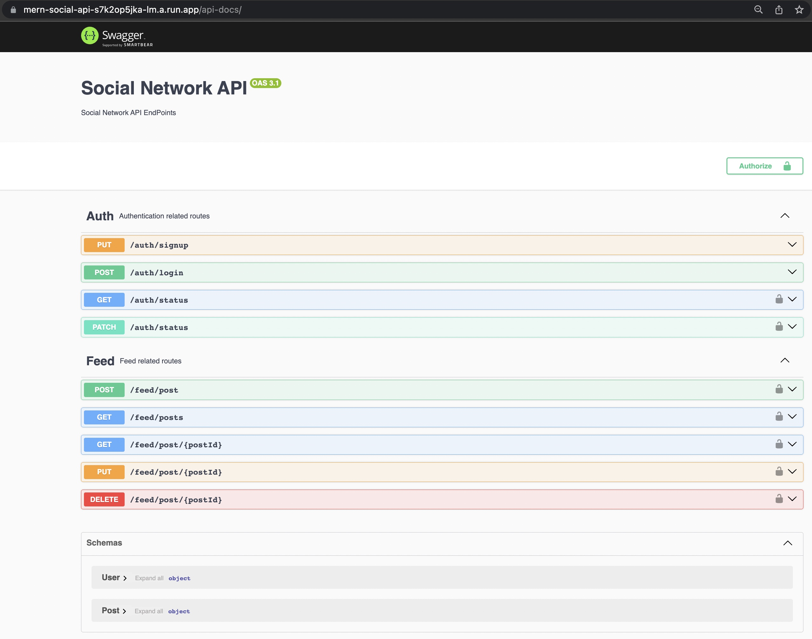
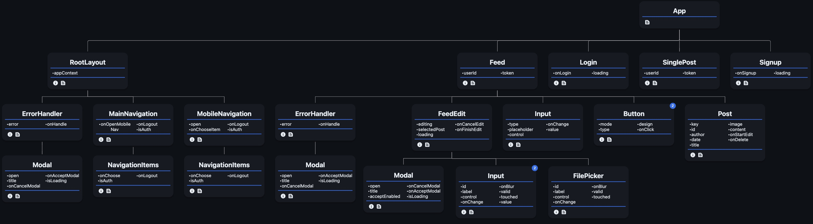

<a name="readme-top"></a>

[![Contributors][contributors-shield]][contributors-url]
[![Forks][forks-shield]][forks-url]
[![Stargazers][stars-shield]][stars-url]
[![Issues][issues-shield]][issues-url]
[![MIT License][license-shield]][license-url]
[![LinkedIn][linkedin-shield]][linkedin-url]

<!-- PROJECT LOGO -->
<br />
<div align="center">
  <a href="https://github.com/MateuszKrolik/MERN_Social_Network">
    
  </a>

<h3 align="center">RealTime Social Network</h3>
  <p align="center">
    <br />
    <a href="https://github.com/MateuszKrolik/MERN_Social_Network"><strong>Explore the docs »</strong></a>
    <br />
    <br />
    <a href="https://github.com/MateuszKrolik/MERN_Social_Network">View Demo</a>
    ·
    <a href="https://github.com/MateuszKrolik/MERN_Social_Network/issues">Report Bug</a>
    ·
    <a href="https://github.com/MateuszKrolik/MERN_Social_Network/issues">Request Feature</a>
  </p>
</div>

<!-- TABLE OF CONTENTS -->
<details>
  <summary>Table of Contents</summary>
  <ol>
    <li>
      <a href="#about-the-project">About The Project</a>
      <ul>
        <li><a href="#built-with">Built With</a></li>
      </ul>
    </li>
    <li>
      <a href="#getting-started">Getting Started</a>
      <ul>
        <li><a href="#installation">Installation</a></li>
      </ul>
    </li>
    <li><a href="#usage">Usage</a></li>
    <li><a href="#roadmap">Roadmap</a></li>
    <li><a href="#contributing">Contributing</a></li>
    <li><a href="#license">License</a></li>
    <li><a href="#contact">Contact</a></li>
    <li><a href="#acknowledgments">Acknowledgments</a></li>
  </ol>
</details>

<!-- ABOUT THE PROJECT -->

## About The Project

### Click below image to open the WebSite 😁

[![Product Name Screen Shot][product-screenshot]](https://mern-social-network-416113.web.app/)

### Click below image to open the API Docs 🙃

[](https://mkrolik-social-api-de4b456-s7k2op5jka-ew.a.run.app/api-docs/)

### MongoDB Schema Visualization 🙂 (Hackolade)


### Component Tree Hierarchy Visualization 😁 (w/ Props)



<p align="right">(<a href="#readme-top">back to top</a>)</p>

### Built With

<!-- Backend -->

-   [![MVC][MVC]][MVC-url]
-   [![Node.js][Node.js]][Node-url]
-   [![Express.js][Express.js]][Express-url]
-   [![Express Validator][ExpressValidator]][ExpressValidator-url]
<!-- Database Technologies -->
-   [![MongoDB][MongoDB]][MongoDB-url]
-   [![Mongoose][Mongoose]][Mongoose-url]
<!-- Auth -->
-   [![JSON Web Tokens][JSON Web Tokens]][JSON Web Tokens-url]
<!-- WebSockets -->
-   [![Socket.IO][Socket.IO]][Socket.IO-url]
<!-- Programming Languages -->
-   [![JavaScript][JavaScript]][JavaScript-url]
-   [![TypeScript][TypeScript]][TypeScript-url]
<!-- FrontEnd -->
-   [![React][React]][React-url]
-   [![React Router][React Router]][React Router-url]
-   [![Material-UI][Material-UI]][Material-UI-url]
-   [![Axios][Axios]][Axios-url]
-   [![HTML5][HTML5]][HTML5-url]
-   [![CSS3][CSS3]][CSS3-url]
<!-- Build Tools -->
-   [![NPM][NPM]][NPM-url]
-   [![NodeMon][NodeMon]][NodeMon-url]
-   [![Webpack][Webpack]][Webpack-url]
<!-- Containerization -->
-   [![Docker][Docker]][Docker-url]
-   [![Linux/Unix][Linux/Unix]][Linux/Unix-url]
-   [![Bash][Bash]][Bash-url]
<!-- Cloud Technologies -->
-   [![Google Cloud Platform][Google Cloud Platform]][Google Cloud Platform-url]
-   [![Google Cloud Storage][Google Cloud Storage]][Google Cloud Storage-url]
-   [![GCP Cloud Build][GCP Cloud Build]][GCP Cloud Build-url]
-   [![GCP Artifact Registry][GCP Artifact Registry]][GCP Artifact Registry-url]
-   [![GCP Cloud Run][GCP Cloud Run]][GCP Cloud Run-url]
-   [![GCP Cloud SQL][GCP Cloud SQL]][GCP Cloud SQL-url]
-   [![GCP Secret Manager][GCP Secret Manager]][GCP Secret Manager-url]
-   [![GCP IAM][GCP IAM]][GCP IAM-url]
-   [![Firebase Static Hosting][Firebase Static Hosting]][Firebase Static Hosting-url]
<!-- Testing and Version Control -->
-   [![SwaggerUI/OpenAPI][SwaggerUI/OpenAPI]][SwaggerUI/OpenAPI-url]
-   [![Postman][Postman]][Postman-url]
-   [![Mocha.js][Mocha.js]][Mocha.js-url]
-   [![Chai.js][Chai.js]][Chai.js-url]
-   [![Sinon.js][Sinon.js]][Sinon.js-url]
-   [![GitHub Actions][GitHub Actions]][GitHub Actions-url]
<!-- Data Formats -->
-   [![YAML][YAML]][YAML-url]
-   [![JSON][JSON]][JSON-url]
-   [![.env][.env]][.env-url]
<!-- IDEs and Editors -->
-   [![VSCode][VSCode]][VSCode-url]
<!-- Other Technologies -->
-   [![FFmpeg][FFmpeg]][FFmpeg-url]

<p align="right">(<a href="#readme-top">back to top</a>)</p>

<!-- GETTING STARTED -->

## Getting Started

As a prerequisite I recommend having Node.js and NPM installed, as well as Docker for Desktop.

For a Smooth DataBase management experience also consider using MongoDB Compass.

### Installation

1. Clone the repo
    ```sh
    git clone https://github.com/MateuszKrolik/MERN_Social_Network.git
    ```
2. Build Docker Image
    ```sh
    docker compose up --build
    ```
3. Enter your environment variables in `.env`, `nodemon.json` and `GCP Secret Manager`.
    ```js
    MONGO_USER = "ENTER YOUR MONGO_USER";
    MONGO_PASSWORD = "ENTER YOUR MONGO_PASSWORD";
    MONGO_DEFAULT_DATABASE = "ENTER YOUR MONGO_DEFAULT_DATABASE";
    MONGO_DEFAULT_TEST_DATABASE = "ENTER YOUR MONGO_DEFAULT_TEST_DATABASE";
    JWT_SECRET = "ENTER YOUR JWT_SECRET";
    GCP_CREDENTIALS = "ENTER YOUR GCP_CREDENTIALS";
    ```
4. When deploying remember to create a GitHub master branch trigger in GCP Cloud Build, and don't forget to set all the necessary GCP IAM Roles.

<p align="right">(<a href="#readme-top">back to top</a>)</p>

<!-- USAGE EXAMPLES -->

## Usage

_Below you'll find visual usage example representation if form of screenshots.
To test these out yourself visit this [Link](https://mern-social-network-416113.web.app/) 😉_

https://github.com/MateuszKrolik/MERN_Social_Network/assets/127691471/fc140634-830f-4bb3-afe9-2085b6225d43

<div align="center">
  <a href="https://mern-social-network-416113.web.app/signup">
    
  </a>

https://github.com/MateuszKrolik/MERN_Social_Network/assets/127691471/cd522993-ed44-414b-9669-f8a3b7a327ee

  <a href="https://mern-social-network-416113.web.app/">
    
  </a>
  <a href="https://mern-social-network-416113.web.app/">
    
  </a>
  <a href="https://mern-social-network-416113.web.app/">
    
  </a>  
  <a href="https://mern-social-network-416113.web.app/">
    
  </a>    
</div>

<p align="right">(<a href="#readme-top">back to top</a>)</p>

<!-- ROADMAP -->

## Roadmap

### Architecture and Core Technologies

-   [x] Monolithic Architecture: Model-View-Controller (MVC)
-   [x] Backend REST API via Node.js Framework (Express.js)
-   [x] Frontend Reactive Single-Page-App (SPA) - React & ReactRouter@6.4 Libraries
-   [x] Cross-Origin-Resource-Sharing (CORS)
-   [x] TypeScript for Static & Strong Type Linting Checks

### Data Management

-   [x] Hosted NoSQL Database (MongoDB Atlas)
-   [x] Mongoose Object-Document-Mapper (ODM)
-   [x] Create-Read-Update-Delete (CRUD) Functionality
-   [x] User Input Validation (Express-Validator)

### Authentication and Authorization

-   [x] Authentication and Authorization
    -   [x] Password Encryption (Bcrypt)
    -   [x] JSON Web Tokens(JWT)

### Real-Time Communication

-   [x] RealTime WebSocket Updates via Socket.io

### File Handling

-   [x] Multer Package File upload w/ Cloud Object Storage (Google Cloud Storage)

### Testing

-   [x] Test-Driven-Development(TDD) - Manual, Unit and Integration via:
    -   [x] PostMan/REST Client
    -   [x] Mocha.js
    -   [x] Chai.js
    -   [x] Sinon.js
    -   [x] Mock testing MongoDB DataBase

### Deployment and Infrastructure

-   [x] Infrastructure-as-Code (IaC) via CloudBuild YAML file
-   [x] Automatized Dockerized CI/CD & IaC Serverless Deployment via:
    -   [x] GitHub Actions - Master Branch Trigger
    -   [x] GCP Cloud Build (IaC & CI/CD)
    -   [x] GCP Cloud Run (FaaS/PaaS)
    -   [x] GCP Artifact Registry
    -   [x] GCP Secret Manager (.ENV)
    -   [x] GCP IAM Roles (Least Priveleged Principle)
-   [x] Static Frontend WebPack Module Bundle Hosting via GCP FireBase

### Documentation

-   [x] JSDOC+SwaggerUI/OpenAPI auto-generated EndPoint Documentation

### Security

-   [x] Secure HTTP Response Headers (Helmet.js)
-   [x] SSL/TLS Encryption
-   [x] Environment Variables for Securing Sensitive Data

### User Interface and Experience

-   [x] Google's Material UI/Design React Components
-   [x] DarkMode
-   [x] Mobile Responsiveness

### Other Features and Best Practices

-   [x] Dynamic routing
-   [x] Error Handling
-   [x] Pagination
-   [x] Axios HTTP Client (Browser Fetch API Alternative)
-   [x] AJAX
-   [x] Lazy Loading
-   [x] Visualized MongoDB Schema (Hackolade)

See the [open issues](https://github.com/MateuszKrolik/MERN_Social_Network/issues) for a full list of proposed features (and known issues).

<p align="right">(<a href="#readme-top">back to top</a>)</p>

<!-- CONTRIBUTING -->

## Contributing

Contributions are what make the open source community such an amazing place to learn, inspire, and create. Any contributions you make are **greatly appreciated**.

If you have a suggestion that would make this better, please fork the repo and create a pull request. You can also simply open an issue with the tag "enhancement".
Don't forget to give the project a star! Thanks again!

1. Fork the Project
2. Create your Feature Branch (`git checkout -b feature/AmazingFeature`)
3. Commit your Changes (`git commit -m 'Add some AmazingFeature'`)
4. Push to the Branch (`git push origin feature/AmazingFeature`)
5. Open a Pull Request

<p align="right">(<a href="#readme-top">back to top</a>)</p>

<!-- LICENSE -->

## License

Distributed under the MIT License. See `LICENSE` for more information.

<p align="right">(<a href="#readme-top">back to top</a>)</p>

<!-- CONTACT -->

## Contact

Mateusz Królik - [Mateusz Królik](https://www.linkedin.com/in/mateusz-kr%C3%B3lik-8b1862262/) - [mateuszkrolik87@gmail.com](mailto:mateuszkrolik7@gmail.com)

Project Link: [Project Link](https://mern-social-network-416113.web.app/)

API Docs Link: [API Docs Link](https://mkrolik-social-api-de4b456-s7k2op5jka-ew.a.run.app/api-docs/)

GitHub Repository Link: [GitHub Repository Link](https://github.com/MateuszKrolik/MERN_Social_Network)

<p align="right">(<a href="#readme-top">back to top</a>)</p>

<!-- ACKNOWLEDGMENTS -->

## Acknowledgments

-   [Free Material-UI Login & SignUp Templates](https://mui.com/material-ui/getting-started/templates/)
-   [Img Shields](https://shields.io)
-   [GitHub Emoji Cheat Sheet](https://www.webpagefx.com/tools/emoji-cheat-sheet)
-   [Malven's Flexbox Cheatsheet](https://flexbox.malven.co/)
-   [Malven's Grid Cheatsheet](https://grid.malven.co/)
-   [SVG Repo](https://www.svgrepo.com/)

<p align="right">(<a href="#readme-top">back to top</a>)</p>

<!-- MARKDOWN LINKS & IMAGES -->
<!-- https://www.markdownguide.org/basic-syntax/#reference-style-links -->

[contributors-shield]: https://img.shields.io/github/contributors/MateuszKrolik/EXPRESS-SHOP.svg?style=for-the-badge
[contributors-url]: https://github.com/MateuszKrolik/MERN_Social_Network/graphs/contributors
[forks-shield]: https://img.shields.io/github/forks/MateuszKrolik/EXPRESS-SHOP.svg?style=for-the-badge
[forks-url]: https://github.com/MateuszKrolik/MERN_Social_Network/network/members
[stars-shield]: https://img.shields.io/github/stars/MateuszKrolik/EXPRESS-SHOP.svg?style=for-the-badge
[stars-url]: https://github.com/MateuszKrolik/MERN_Social_Network/stargazers
[issues-shield]: https://img.shields.io/github/issues/MateuszKrolik/EXPRESS-SHOP.svg?style=for-the-badge
[issues-url]: https://github.com/MateuszKrolik/MERN_Social_Network/issues
[license-shield]: https://img.shields.io/github/license/MateuszKrolik/EXPRESS-SHOP.svg?style=for-the-badge
[license-url]: https://github.com/MateuszKrolik/MERN_Social_Network/blob/master/LICENSE
[linkedin-shield]: https://img.shields.io/badge/-LinkedIn-black.svg?style=for-the-badge&logo=linkedin&colorB=555
[linkedin-url]: https://linkedin.com/in/mateusz-królik-8b1862262
[product-screenshot]: images/screenshot.jpg
[Express.js]: https://img.shields.io/badge/Express.js-404D59?style=for-the-badge&logo=express
[Express-url]: https://expressjs.com/
[MongoDB]: https://img.shields.io/badge/MongoDB-4EA94B?style=for-the-badge&logo=mongodb&logoColor=white
[MongoDB-url]: https://www.mongodb.com/
[Mongoose]: https://img.shields.io/badge/Mongoose-880000?style=for-the-badge&logo=mongoose&logoColor=white
[Mongoose-url]: https://mongoosejs.com/
[React]: https://img.shields.io/badge/React-20232A?style=for-the-badge&logo=react&logoColor=61DAFB
[React-url]: https://reactjs.org/
[Webpack]: https://img.shields.io/badge/Webpack-8DD6F9?style=for-the-badge&logo=webpack&logoColor=black
[Webpack-url]: https://webpack.js.org/
[Docker]: https://img.shields.io/badge/Docker-2CA5E0?style=for-the-badge&logo=docker&logoColor=white
[Docker-url]: https://www.docker.com/
[Linux/Unix]: https://img.shields.io/badge/Linux-FCC624?style=for-the-badge&logo=linux&logoColor=black
[Linux/Unix-url]: https://www.linux.org/
[Node.js]: https://img.shields.io/badge/Node.js-43853D?style=for-the-badge&logo=node.js&logoColor=white
[Node-url]: https://nodejs.org/
[NodeMon]: https://img.shields.io/badge/Nodemon-76D04B?style=for-the-badge&logo=nodemon&logoColor=white
[NodeMon-url]: https://nodemon.io/
[JavaScript]: https://img.shields.io/badge/JavaScript-F7DF1E?style=for-the-badge&logo=javascript&logoColor=black
[JavaScript-url]: https://www.javascript.com/
[NPM]: https://img.shields.io/badge/npm-CB3837?style=for-the-badge&logo=npm&logoColor=white
[NPM-url]: https://www.npmjs.com/
[Socket.IO]: https://img.shields.io/badge/Socket.IO-010101?style=for-the-badge&logo=socketdotio&logoColor=white
[Socket.IO-url]: https://socket.io/
[JSON Web Tokens]: https://img.shields.io/badge/JSON_Web_Tokens-000000?style=for-the-badge&logo=jsonwebtokens&logoColor=white
[JSON Web Tokens-url]: https://jwt.io/
[Google Cloud Platform]: https://img.shields.io/badge/Google_Cloud-4285F4?style=for-the-badge&logo=google-cloud&logoColor=white
[Google Cloud Platform-url]: https://cloud.google.com/
[GCP App Engine Flexible-url]: https://cloud.google.com/appengine
[Google Cloud Storage]: https://img.shields.io/badge/Google_Cloud_Storage-4285F4?style=for-the-badge&logo=googlecloudstorage&logoColor=white
[Google Cloud Storage-url]: https://cloud.google.com/storage
[Firebase Static Hosting]: https://img.shields.io/badge/Firebase_Static_Hosting-FFCA28?style=for-the-badge&logo=firebase&logoColor=black
[Firebase Static Hosting-url]: https://firebase.google.com/products/hosting/
[HTML5]: https://img.shields.io/badge/HTML5-E34F26?style=for-the-badge&logo=html5&logoColor=white
[HTML5-url]: https://www.w3.org/html/
[CSS3]: https://img.shields.io/badge/CSS3-1572B6?style=for-the-badge&logo=css3&logoColor=white
[CSS3-url]: https://www.w3.org/Style/CSS/Overview.en.html
[Mocha.js]: https://img.shields.io/badge/Mocha-8D6748?style=for-the-badge&logo=mocha&logoColor=white
[Mocha.js-url]: https://mochajs.org/
[Chai.js]: https://img.shields.io/badge/Chai-A11404?style=for-the-badge&logo=chai&logoColor=white
[Chai.js-url]: https://www.chaijs.com/
[Sinon.js]: https://img.shields.io/badge/Sinon-FFFFFF?style=for-the-badge&logo=data:image/svg+xml;base64,PD94bWwgdmVyc2lvbj0iMS4wIiBlbmNvZGluZz0idXRmLTgiPz48IS0tIFVwbG9hZGVkIHRvOiBTVkcgUmVwbywgd3d3LnN2Z3JlcG8uY29tLCBHZW5lcmF0b3I6IFNWRyBSZXBvIE1peGVyIFRvb2xzIC0tPg0KPHN2ZyB3aWR0aD0iODAwcHgiIGhlaWdodD0iODAwcHgiIHZpZXdCb3g9IjAgMCAyNCAyNCIgZmlsbD0ibm9uZSIgeG1sbnM9Imh0dHA6Ly93d3cudzMub3JnLzIwMDAvc3ZnIj4NCjxwYXRoIGQ9Ik04LjI2Njk3IDEuNjE4NDVDOC40Nzc3NiAxLjI2MTg4IDguOTM3NyAxLjE0MzcxIDkuMjk0MjcgMS4zNTQ0OUwxMC4xMjYgMS44NDYxOUwxOS4zNzMxIDcuMTUzMzhDMTkuNzMyNCA3LjM1OTU3IDE5Ljg1NjQgNy44MTc5NCAxOS42NTAzIDguMTc3MTlDMTkuNDQ0MSA4LjUzNjQ0IDE4Ljk4NTcgOC42NjA1MyAxOC42MjY0IDguNDU0MzRMMTcuNzgyOCA3Ljk3MDEzTDE2LjI3OCAxMC41Njc1TDE2LjI3NjIgMTAuNTY2NUwxMy43MTgxIDkuMDk0NjdDMTMuMzU5MSA4Ljg4ODEgMTIuOTAwNiA5LjAxMTY5IDEyLjY5NCA5LjM3MDcyQzEyLjQ4NzUgOS43Mjk3NSAxMi42MTEgMTAuMTg4MyAxMi45NzAxIDEwLjM5NDhMMTUuNTI2IDExLjg2NTRMMTQuNTY0NiAxMy41MjVMMTQuNTYyOCAxMy41MjM5TDEwLjM1OTggMTEuMTA1N0MxMC4wMDA4IDEwLjg5OTEgOS41NDIyNyAxMS4wMjI3IDkuMzM1NyAxMS4zODE4QzkuMTI5MTMgMTEuNzQwOCA5LjI1MjcyIDEyLjE5OTMgOS42MTE3NSAxMi40MDU5TDEzLjgxMjYgMTQuODIyOUwxMi45MjcgMTYuMzUxNUwxMi45MjUyIDE2LjM1MDVMMTAuMzEyNSAxNC44NDcyQzkuOTUzNDggMTQuNjQwNyA5LjQ5NDk3IDE0Ljc2NDMgOS4yODg0IDE1LjEyMzNDOS4wODE4MyAxNS40ODIzIDkuMjA1NDIgMTUuOTQwOCA5LjU2NDQ1IDE2LjE0NzRMMTIuMTc1MSAxNy42NDk0TDExLjA1NTggMTkuNTgxNEM5LjcxNTggMjEuODk0MyA2Ljc0ODAzIDIyLjY4NjggNC40MjcwOSAyMS4zNTE0QzIuMTA2MTUgMjAuMDE2MSAxLjMxMDkzIDE3LjA1ODUgMi42NTA5MyAxNC43NDU2TDkuMzcyNjggMy4xNDMzMkw5LjM2NjgyIDMuMTM5ODlMOC41MzA5MyAyLjY0NTc0QzguMTc0MzYgMi40MzQ5NSA4LjA1NjE4IDEuOTc1MDIgOC4yNjY5NyAxLjYxODQ1WiIgZmlsbD0iIzFDMjc0QyIvPg0KPHBhdGggZD0iTTIwIDE2Ljk5OTlDMjEuMTA0NiAxNi45OTk5IDIyIDE2LjA2NzIgMjIgMTQuOTE2NkMyMiAxNC4xOTY3IDIxLjIxNyAxMy4yMzU4IDIwLjYzMDkgMTIuNjE3NEMyMC4yODM5IDEyLjI1MTIgMTkuNzE2MSAxMi4yNTEyIDE5LjM2OTEgMTIuNjE3NEMxOC43ODMgMTMuMjM1OCAxOCAxNC4xOTY3IDE4IDE0LjkxNjZDMTggMTYuMDY3MiAxOC44OTU0IDE2Ljk5OTkgMjAgMTYuOTk5OVoiIGZpbGw9IiMxQzI3NEMiLz4NCjwvc3ZnPg==&color=white&logoColor=black
[Sinon.js-url]: https://sinonjs.org/
[Postman]: https://img.shields.io/badge/Postman-FF6C37?style=for-the-badge&logo=postman&logoColor=white
[Postman-url]: https://www.postman.com/
[Material-UI]: https://img.shields.io/badge/Material--UI-ffffff?style=for-the-badge&logo=data:image/svg+xml;base64,PHN2ZyB2aWV3Qm94PSIwIDAgNjAwIDQ3Ni4zMDAwMDAwMDAwMDAwNyIgeG1sbnM9Imh0dHA6Ly93d3cudzMub3JnLzIwMDAvc3ZnIiB3aWR0aD0iMjUwMCIgaGVpZ2h0PSIxOTg1Ij48cGF0aCBkPSJNMCAyNTkuOFYwbDIyNSAxMjkuOXY4Ni42TDc1IDEyOS45djE3My4yeiIgZmlsbD0iIzAwYjBmZiIvPjxwYXRoIGQ9Ik0yMjUgMTI5LjlMNDUwIDB2MjU5LjhsLTE1MCA4Ni42LTc1LTQzLjMgMTUwLTg2LjZ2LTg2LjZsLTE1MCA4Ni42eiIgZmlsbD0iIzAwODFjYiIvPjxwYXRoIGQ9Ik0yMjUgMzAzLjF2ODYuNmwxNTAgODYuNnYtODYuNnoiIGZpbGw9IiMwMGIwZmYiLz48cGF0aCBkPSJNMzc1IDQ3Ni4zbDIyNS0xMjkuOVYxNzMuMmwtNzUgNDMuM3Y4Ni42bC0xNTAgODYuNnptMTUwLTM0Ni40VjQzLjNMNjAwIDB2ODYuNnoiIGZpbGw9IiMwMDgxY2IiLz48L3N2Zz4=&logoColor=white
[Material-UI-url]: https://material-ui.com/
[React Router]: https://img.shields.io/badge/React_Router-CA4245?style=for-the-badge&logo=react-router&logoColor=white
[React Router-url]: https://reactrouter.com/
[Axios]: https://img.shields.io/badge/Axios-4EA94B?style=for-the-badge&logo=axios&logoColor=white
[Axios-url]: https://axios-http.com/
[Bash]: https://img.shields.io/badge/Bash-4EAA4B?style=for-the-badge&logo=gnu-bash&logoColor=white
[Bash-url]: https://www.gnu.org/software/bash/
[TypeScript]: https://img.shields.io/badge/TypeScript-3178C6?style=for-the-badge&logo=typescript&logoColor=white
[TypeScript-url]: https://www.typescriptlang.org/
[SwaggerUI/OpenAPI]: https://img.shields.io/badge/-SwaggerUI/OpenAPI-%2385EA2D?style=for-the-badge&logo=swagger&logoColor=white
[SwaggerUI/OpenAPI-url]: https://swagger.io/
[GCP Cloud Build]: https://img.shields.io/badge/GCP_Cloud_Build-4285F4?style=for-the-badge&logo=data:image/svg+xml;base64,PHN2ZyB4bWxucz0iaHR0cDovL3d3dy53My5vcmcvMjAwMC9zdmciIHhtbG5zOnhsaW5rPSJodHRwOi8vd3d3LnczLm9yZy8xOTk5L3hsaW5rIiB2aWV3Qm94PSIwIDAgNzIgODEiIGZpbGw9IiNmZmYiIGZpbGwtcnVsZT0iZXZlbm9kZCIgc3Ryb2tlPSIjMDAwIiBzdHJva2UtbGluZWNhcD0icm91bmQiIHN0cm9rZS1saW5lam9pbj0icm91bmQiPjx1c2UgeGxpbms6aHJlZj0iI0EiIHg9Ii41IiB5PSIuNSIvPjxzeW1ib2wgaWQ9IkEiIG92ZXJmbG93PSJ2aXNpYmxlIj48ZyBzdHJva2U9Im5vbmUiIGZpbGwtcnVsZT0ibm9uemVybyI+PHBhdGggZD0iTTM1LjMyOSA1Ny4zOTlsMTQuMzYtOC4yODFWMzIuNTU1bC00LjgxNC0yLjgxNS0xNC4zNiAyNC44ODUgNC44MTQgMi43NzR6IiBmaWxsPSIjNDI4NWY0Ii8+PHBhdGggZD0iTTIwLjk2OSAzMi41NTV2MTYuNTYzbDQuODE0IDIuNzc0IDE0LjQwMS0yNC44NDQtNC44NTUtMi44MTUtMTQuMzYgOC4zMjJ6IiBmaWxsPSIjNjY5ZGY2Ii8+PHBhdGggZD0iTTMyLjUxNCA2Mi4zMzVsLTE3LjIxNi05Ljk1NFYzMi41NTVMMCAyMy43MDJ2MzcuNTMyTDMyLjUxNCA4MFY2Mi4zMzV6TTE4LjExMyAyNy42NTlsMTcuMjE2LTkuOTU0IDE3LjIxNiA5Ljk1NCAxNS4zMzktOC44NTNMMzUuMzI5IDAgMi43NzQgMTguODA3bDE1LjMzOSA4Ljg1M3pNNTUuMzYgNTIuMzgxbC0xNy4yMTYgOS45NTRWODBsMzIuNTU1LTE4Ljc2NlYyMy43MDJMNTUuMzYgMzIuNTU1djE5LjgyN3oiIGZpbGw9IiNhZWNiZmEiLz48L2c+PC9zeW1ib2w+PC9zdmc+
[GCP Cloud Build-url]: https://cloud.google.com/cloud-build
[GCP Artifact Registry]: https://img.shields.io/badge/GCP_Artifact_Registry-FFFFFF?style=for-the-badge&logo=data:image/svg+xml;base64,PHN2ZyB2ZXJzaW9uPSIxLjEiIGJhc2VQcm9maWxlPSJ0aW55IiBpZD0iTGF5ZXJfMSIgeG1sbnM9Imh0dHA6Ly93d3cudzMub3JnLzIwMDAvc3ZnIiB4bWxuczp4bGluaz0iaHR0cDovL3d3dy53My5vcmcvMTk5OS94bGluayIKCSB4PSIwcHgiIHk9IjBweCIgd2lkdGg9IjI0cHgiIGhlaWdodD0iMjRweCIgdmlld0JveD0iMCAwIDI0IDI0IiBvdmVyZmxvdz0idmlzaWJsZSIgeG1sOnNwYWNlPSJwcmVzZXJ2ZSI+CjxnID4KCTxyZWN0IHk9IjAiIGZpbGw9Im5vbmUiIHdpZHRoPSIyNCIgaGVpZ2h0PSIyNCIvPgoJPHBvbHlnb24gZmlsbC1ydWxlPSJldmVub2RkIiBmaWxsPSIjNUM4NURFIiBwb2ludHM9IjYsMi40IDAuOCw1LjQgMC44LDE5LjEgNiwyMi4xIDYsMTkuNSAzLDE3LjggMyw2LjcgNiw1IAkiLz4KCTxwb2x5Z29uIGZpbGwtcnVsZT0iZXZlbm9kZCIgZmlsbD0iIzMzNjdENiIgcG9pbnRzPSIwLjgsOCAwLjgsMTYuNSAzLDE3LjggMyw2LjcgCSIvPgoJPHBvbHlnb24gZmlsbC1ydWxlPSJldmVub2RkIiBmaWxsPSIjMzM2N0Q2IiBwb2ludHM9IjAuOCw4IDMsNy41IDMsNi43IAkiLz4KCTxwb2x5Z29uIGZpbGwtcnVsZT0iZXZlbm9kZCIgZmlsbD0iIzVDODVERSIgcG9pbnRzPSIxOCwyLjQgMTgsNSAyMSw2LjcgMjEsMTcuOCAxOCwxOS41IDE4LDIyLjEgMjMuMiwxOS4xIDIzLjIsNS40IAkiLz4KCTxwb2x5Z29uIGZpbGwtcnVsZT0iZXZlbm9kZCIgZmlsbD0iIzMzNjdENiIgcG9pbnRzPSIyMSwxNy44IDIzLjIsMTYuNSAyMy4yLDggMjEsNi43IAkiLz4KCTxwb2x5Z29uIGZpbGwtcnVsZT0iZXZlbm9kZCIgZmlsbD0iIzMzNjdENiIgcG9pbnRzPSIyMSw3LjUgMjMuMiw4IDIxLDYuNyAJIi8+Cgk8cG9seWdvbiBmaWxsLXJ1bGU9ImV2ZW5vZGQiIGZpbGw9IiMzMzY3RDYiIHBvaW50cz0iMjEsMTcuMSAyMSwxNy44IDIzLjIsMTYuNSAJIi8+Cgk8ZyB0cmFuc2Zvcm09InRyYW5zbGF0ZSg2Ljg2MDAwMCwgNi41MDAwMDApIj4KCQk8ZyB0cmFuc2Zvcm09InRyYW5zbGF0ZSg0LjU0MDAwMCwgMC4wMDAwMDApIj4KCQkJPHBvbHlnb24gZmlsbC1ydWxlPSJldmVub2RkIiBmaWxsPSIjNUM4NURFIiBwb2ludHM9IjAuNiwtMSAtMi40LDAuNiAwLjYsMi4yIDMuNiwwLjYgCQkJIi8+CgkJCTxwb2x5Z29uIGZpbGwtcnVsZT0iZXZlbm9kZCIgZmlsbD0iIzMzNjdENiIgcG9pbnRzPSIxLDUuOSAzLjksNC4zIDMuOSwxLjIgMSwyLjggCQkJIi8+CgkJCTxwb2x5Z29uIGZpbGwtcnVsZT0iZXZlbm9kZCIgZmlsbD0iIzMzNjdENiIgcG9pbnRzPSIwLjMsMi44IC0yLjcsMS4yIC0yLjcsNC4zIDAuMyw1LjkgCQkJIi8+CgkJPC9nPgoJCTxnIHRyYW5zZm9ybT0idHJhbnNsYXRlKDAuMDAwMDAwLCA3Ljk3NjE5MCkiPgoJCQk8cG9seWdvbiBmaWxsLXJ1bGU9ImV2ZW5vZGQiIGZpbGw9IiM1Qzg1REUiIHBvaW50cz0iMS43LC0zLjEgLTEuMiwtMS41IDEuNywwLjEgNC41LC0xLjUgCQkJIi8+CgkJCTxwb2x5Z29uIGZpbGwtcnVsZT0iZXZlbm9kZCIgZmlsbD0iIzMzNjdENiIgcG9pbnRzPSIxLjksMy44IDQuOCwyLjIgNC44LC0xIDEuOSwwLjYgCQkJIi8+CgkJCTxwb2x5Z29uIGZpbGwtcnVsZT0iZXZlbm9kZCIgZmlsbD0iIzMzNjdENiIgcG9pbnRzPSIxLjQsMC42IC0xLjUsLTEgLTEuNSwyLjIgMS40LDMuOCAJCQkiLz4KCQk8L2c+CgkJPGcgdHJhbnNmb3JtPSJ0cmFuc2xhdGUoOS4zNjAwMDAsIDcuOTc2MTkwKSI+CgkJCTxwb2x5Z29uIGZpbGwtcnVsZT0iZXZlbm9kZCIgZmlsbD0iIzVDODVERSIgcG9pbnRzPSItMC43LC0zLjEgLTMuNiwtMS41IC0wLjcsMC4xIDIuMiwtMS41IAkJCSIvPgoJCQk8cG9seWdvbiBmaWxsLXJ1bGU9ImV2ZW5vZGQiIGZpbGw9IiMzMzY3RDYiIHBvaW50cz0iLTAuNCwzLjggMi41LDIuMiAyLjUsLTEgLTAuNCwwLjYgCQkJIi8+CgkJCTxwb2x5Z29uIGZpbGwtcnVsZT0iZXZlbm9kZCIgZmlsbD0iIzMzNjdENiIgcG9pbnRzPSItMSwwLjYgLTMuOSwtMSAtMy45LDIuMiAtMSwzLjggCQkJIi8+CgkJPC9nPgoJPC9nPgo8L2c+Cjwvc3ZnPgo=
[GCP Artifact Registry-url]: https://cloud.google.com/artifact-registry
[GCP Cloud Run]: https://img.shields.io/badge/GCP_Cloud_Run-808080?style=for-the-badge&logo=data:image/svg+xml;base64,PD94bWwgdmVyc2lvbj0iMS4wIiBlbmNvZGluZz0iVVRGLTgiPz4KPCEtLSBVcGxvYWRlZCB0bzogU1ZHIFJlcG8sIHd3dy5zdmdyZXBvLmNvbSwgR2VuZXJhdG9yOiBTVkcgUmVwbyBNaXhlciBUb29scyAtLT4KPHN2ZyB3aWR0aD0iODAwcHgiIGhlaWdodD0iODAwcHgiIHZpZXdCb3g9IjAgLTEyLjUgMjU2IDI1NiIgdmVyc2lvbj0iMS4xIiB4bWxucz0iaHR0cDovL3d3dy53My5vcmcvMjAwMC9zdmciIHhtbG5zOnhsaW5rPSJodHRwOi8vd3d3LnczLm9yZy8xOTk5L3hsaW5rIiBwcmVzZXJ2ZUFzcGVjdFJhdGlvPSJ4TWlkWU1pZCI+CgkJPGc+CgkJCQk8cGF0aCBkPSJNNzUuMzkwMTQ3LDAgQzY3LjE5NjQzNjUsMC4xNDQyNDk0NDMgNTkuNjkyNjE0Nyw0LjYxOTQwMzEyIDU1LjY3MDczNSwxMS43NTk0NjU1IEw1NS42NzA3MzUsMTEuNzU5NDY1NSBMMy4wNTI3NTcyNCwxMDIuOTk1ODEzIEMtMS4wMTc1ODU3NSwxMTAuMDc5NDMgLTEuMDE3NTg1NzUsMTE4Ljc5MTk4MiAzLjA1Mjc1NzI0LDEyNS44NzUwMjkgTDMuMDUyNzU3MjQsMTI1Ljg3NTAyOSBMNTUuNjUwNzc5NSwyMTcuODcxOTY0IEM1OS42MzE2MDgsMjI1LjExMTIzNCA2Ny4xMTQ5MDQyLDIyOS43MzM0ODggNzUuMzY5NjIxNCwyMzAuMDUyMjA1IEw3NS4zNjk2MjE0LDIzMC4wNTIyMDUgTDE4MC41ODYxOTIsMjMwLjA1MjIwNSBDMTg4Ljg0MDkwOSwyMjkuNzY4MjY3IDE5Ni4zMzc4ODksMjI1LjE2NDgyOSAyMDAuMzI1NTU5LDIxNy45MzI0MDEgTDIwMC4zMjU1NTksMjE3LjkzMjQwMSBMMjUyLjkyMzU4MSwxMjYuNDU1NDQ4IEMyNTQuOTczMjkyLDEyMi44NTcxOTQgMjU1Ljk5Nzg2MiwxMTguODUxMjc4IDI1NS45OTc4NjIsMTE0Ljg0NTkzMyBMMjU1Ljk5Nzg2MiwxMTQuODQ1OTMzIEMyNTUuOTk3ODYyLDExMC44NDA1ODggMjU0Ljk3MzI5MiwxMDYuODM0NjczIDI1Mi45MjM1ODEsMTAzLjIzNTg0OSBMMjUyLjkyMzU4MSwxMDMuMjM1ODQ5IEwyMDAuMzI1NTU5LDExLjc1OTQ2NTUgQzE5Ni4zMDA4MjksNC42MjIyNTM5IDE4OC43OTkyODcsMC4xNDgyNDA1MzUgMTgwLjYwNjE0NywwIEwxODAuNjA2MTQ3LDAgTDc1LjM5MDE0NywwIFoiIGZpbGw9IiM0Mjg1RjQiPgoNPC9wYXRoPgoJCQkJPHBhdGggZD0iTTIzNi40OTUxNzgsMTU1LjAyNzI0OSBMMjAwLjMyNTU1OSwyMTcuOTMyNDAxIEMxOTYuMzM3ODg5LDIyNS4xNjQ4MjkgMTg4Ljg0MDkwOSwyMjkuNzY4MjY3IDE4MC41ODYxOTIsMjMwLjA1MjIwNSBMMTQwLjUxMDE1OCwyMzAuMDUyMjA1IEw4Mi4wMzgxMDc4LDE3MS4wNTcxNDcgTDk5LjI3NTYzMTIsMTE1LjQ3Mzc4OSBMODIuMDM4MTA3OCw1OS4yNTQxMzYzIEw5OS43NDMxNTksNzEuMTQ3MDE4MyBMMTIzLjU0ODg3OCw5NS4xNjU5NzU5IEwxMTIuNDI5MTI4LDU5LjI1NDEzNjMgTDE5NS44MDQxNjYsMTE1LjI2MTY5MSBMMjM2LjQ5NTE3OCwxNTUuMDI3MjQ5IFoiIGZpbGwtb3BhY2l0eT0iMC4wNyIgZmlsbD0iIzAwMDAwMCIgZmlsbC1ydWxlPSJub256ZXJvIj4KDTwvcGF0aD4KCQkJCTxwYXRoIGQ9Ik04Mi4wMzgyNzg4LDU5LjI1MzkwODIgTDk5Ljc0MzMzMDEsNzEuMTQ3MzYwNCBMMTEzLjYyMjA2NSwxMTUuNzY1NDgxIEw5OS45OTAyMDc2LDE1OS4wNDMxNjQgTDgyLjAzODI3ODgsMTcxLjA1NzQ5IEw5OS4zODA3MTA5LDExNS4yNjE0NjMgTDgyLjAzODI3ODgsNTkuMjUzOTA4MiBaIE0xMjcuMzg1NDU3LDc5LjA4OTkxNzEgTDEzNS45Nzc3MDcsMTA2Ljg4MTU5NiBMMTY4Ljk2NjkyNywxMDYuODgxNTk2IEwxMjcuMzg1NDU3LDc5LjA4OTkxNzEgWiBNMTk1LjgwNDE2NiwxMTUuMjYxNzQ4IEwxMTIuNDI5MTI4LDE3MS4wNTcyMDQgTDEyOS43NzE1NiwxMTUuMjYxNzQ4IEwxMTIuNDI5MTI4LDU5LjI1MzYyMzIgTDE5NS44MDQxNjYsMTE1LjI2MTc0OCBaIiBmaWxsPSIjRkZGRkZGIj4KDTwvcGF0aD4KCQk8L2c+Cjwvc3ZnPg==
[GCP Cloud Run-url]: https://cloud.google.com/run
[GCP Cloud SQL]: https://img.shields.io/badge/GCP_Cloud_SQL-4285F4?style=for-the-badge&logo=data:image/svg+xml;base64,PHN2ZyB4bWxucz0iaHR0cDovL3d3dy53My5vcmcvMjAwMC9zdmciIHhtbG5zOnhsaW5rPSJodHRwOi8vd3d3LnczLm9yZy8xOTk5L3hsaW5rIiB2aWV3Qm94PSIwIDAgNjAgODEiIGZpbGw9IiNmZmYiIGZpbGwtcnVsZT0iZXZlbm9kZCIgc3Ryb2tlPSIjMDAwIiBzdHJva2UtbGluZWNhcD0icm91bmQiIHN0cm9rZS1saW5lam9pbj0icm91bmQiPjx1c2UgeGxpbms6aHJlZj0iI0EiIHg9Ii41IiB5PSIuNSIvPjxzeW1ib2wgaWQ9IkEiIG92ZXJmbG93PSJ2aXNpYmxlIj48ZyBzdHJva2U9Im5vbmUiPjxwYXRoIGQ9Ik0wIDMzLjc2VjQ1LjhsMjkuMzIgMTUuNlY0OS4zNkwwIDMzLjc2em0wIDE4LjZWNjQuNEwyOS4zMiA4MFY2Ny45NkwwIDUyLjM2eiIgZmlsbD0iI2FlY2JmYSIvPjxwYXRoIGQ9Ik0yOS4zMiA2MS40bDI5LjMyLTE1LjZWMzMuNzZsLTI5LjMyIDE1LjZWNjEuNHptMCAxOC42bDI5LjMyLTE1LjZWNTIuMzZsLTI5LjMyIDE1LjZWODB6IiBmaWxsPSIjNjY5ZGY2Ii8+PHBhdGggZD0iTTU4LjY0IDI3LjY0VjE1LjZMMjkuMzIgMHYxMi4wNGwyOS4zMiAxNS42eiIgZmlsbD0iIzQyODVmNCIvPjxwYXRoIGQ9Ik0yOS4zMiAwTDAgMTUuNnYxMi4wNGwyOS4zMi0xNS42VjB6IiBmaWxsPSIjNjY5ZGY2Ii8+PHBhdGggZD0iTTAgMTUuNDh2MTIuMDhsMjkuMzIgMTUuNlYzMS4wOEwwIDE1LjQ4eiIgZmlsbD0iI2FlY2JmYSIvPjxwYXRoIGQ9Ik0yOS4zMiA0My4xNmwyOS4zMi0xNS42VjE1LjQ4bC0yOS4zMiAxNS42djEyLjA4eiIgZmlsbD0iIzY2OWRmNiIvPjwvZz48L3N5bWJvbD48L3N2Zz4=
[GCP Cloud SQL-url]: https://cloud.google.com/sql
[GCP Secret Manager]: https://img.shields.io/badge/GCP_Secret_Manager-FFFFFF?style=for-the-badge&logo=data:image/svg+xml;base64,PD94bWwgdmVyc2lvbj0iMS4wIiBlbmNvZGluZz0idXRmLTgiPz4KDTwhLS0gVXBsb2FkZWQgdG86IFNWRyBSZXBvLCB3d3cuc3ZncmVwby5jb20sIEdlbmVyYXRvcjogU1ZHIFJlcG8gTWl4ZXIgVG9vbHMgLS0+Cjxzdmcgd2lkdGg9IjgwMHB4IiBoZWlnaHQ9IjgwMHB4IiB2aWV3Qm94PSIwIDAgMjQgMjQiIHZlcnNpb249IjEuMSIgeG1sbnM9Imh0dHA6Ly93d3cudzMub3JnLzIwMDAvc3ZnIiB4bWxuczp4bGluaz0iaHR0cDovL3d3dy53My5vcmcvMTk5OS94bGluayI+CiAgICA8ZyBzdHJva2U9Im5vbmUiIHN0cm9rZS13aWR0aD0iMSIgZmlsbD0ibm9uZSIgZmlsbC1ydWxlPSJldmVub2RkIj4KICAgICAgICA8ZyB0cmFuc2Zvcm09InRyYW5zbGF0ZSgyLjAwMDAwMCwgNi4wMDAwMDApIiBmaWxsPSIjNDI4NUY0IiBmaWxsLXJ1bGU9Im5vbnplcm8iPgogICAgICAgICAgICA8cGF0aCBkPSJNMjAsOS40MTQ2OTEyNWUtMTQgTDIwLDExLjg4Njc5MjUgTDE2LjAzNzczNTgsMTEuODg2NzkyNSBDMTUuOTMzNTMxMiwxMS44ODY3OTI1IDE1Ljg0OTA1NjYsMTEuODAyMzE3OSAxNS44NDkwNTY2LDExLjY5ODExMzIgTDE1Ljg0OTA1NjYsMTAuNTY2MDM3NyBDMTUuODQ5MDU2NiwxMC40NjE4MzMxIDE1LjkzMzUzMTIsMTAuMzc3MzU4NSAxNi4wMzc3MzU4LDEwLjM3NzM1ODUgTDE4LjQ5MDA1NjYsMTAuMzc3IEwxOC40OTAwNTY2LDEuNTA5IEwxNi4wMzc3MzU4LDEuNTA5NDMzOTYgQzE1LjkzMzUzMTIsMS41MDk0MzM5NiAxNS44NDkwNTY2LDEuNDI0OTU5MzkgMTUuODQ5MDU2NiwxLjMyMDc1NDcyIEwxNS44NDkwNTY2LDAuMTg4Njc5MjQ1IEMxNS44NDkwNTY2LDAuMDg0NDc0NTc1NSAxNS45MzM1MzEyLDkuNDExMDU0MzRlLTE0IDE2LjAzNzczNTgsOS40MTQ2OTEyNWUtMTQgTDIwLDkuNDE0NjkxMjVlLTE0IFogTTQuMzA5MTAxLDkuNDE0NjkxMjVlLTE0IEM0LjQxMzMwNTY3LDkuMzg3Nzg2OWUtMTQgNC40OTc3ODAyNCwwLjA4NDQ3NDU3NTUgNC40OTc3ODAyNCwwLjE4ODY3OTI0NSBMNC40OTc3ODAyNCwxLjMyMDc1NDcyIEM0LjQ5Nzc4MDI0LDEuNDI0OTU5MzkgNC40MTMzMDU2NywxLjUwOTQzMzk2IDQuMzA5MTAxLDEuNTA5NDMzOTYgTDEuNTA5LDEuNTA5IEwxLjUwOSwxMC4zNzcgTDQuMjkyNDUyODMsMTAuMzc3MzU4NSBDNC4zOTY2NTc1LDEwLjM3NzM1ODUgNC40ODExMzIwOCwxMC40NjE4MzMxIDQuNDgxMTMyMDgsMTAuNTY2MDM3NyBMNC40ODExMzIwOCwxMS42OTgxMTMyIEM0LjQ4MTEzMjA4LDExLjgwMjMxNzkgNC4zOTY2NTc1LDExLjg4Njc5MjUgNC4yOTI0NTI4MywxMS44ODY3OTI1IEwyLjE0MDUwOTk5ZS0xMywxMS44ODY3OTI1IEwyLjE0MDUwOTk5ZS0xMyw5LjQxNDY5MTI1ZS0xNCBMNC4zMDkxMDEsOS40MTQ2OTEyNWUtMTQgWiBNMTUuNDI3MTA5OCwzLjg2NzkyNDUzIEwxNS40MjcxMDk4LDUuMzI0MDU2NiBMMTUuNDg3OTMwNSw1LjM0ODUyOTQxIEwxNi44MzgxNDk0LDQuODcxMzA5NjYgTDE3LjExNzkyNDUsNS42OTExNDg3MiBMMTUuNzU1NTQxNCw2LjE1NjEzMjA4IEwxNS43MTkwNDksNi4yNTQwMjMzMSBMMTYuNjU1Njg3NCw3LjUxNDM3MjkyIEwxNS45NTAxNjc2LDguMDI4MzAxODkgTDE1LjAzNzg1NzUsNi43Njc5NTIyOCBMMTQuOTUyNzA4NSw2Ljc2Nzk1MjI4IEwxNC4wNDAzOTg0LDguMDI4MzAxODkgTDEzLjMzNDg3ODYsNy41MTQzNzI5MiBMMTQuMjU5MzUyOSw2LjI1NDAyMzMxIEwxNC4yMzUwMjQ2LDYuMTU2MTMyMDggTDEyLjg3MjY0MTUsNS42OTExNDg3MiBMMTMuMTUyNDE2Niw0Ljg3MTMwOTY2IEwxNC40OTA0NzE0LDUuMzQ4NTI5NDEgTDE0LjU2MzQ1NjIsNS4zMjQwNTY2IEwxNC41NjM0NTYyLDMuODY3OTI0NTMgTDE1LjQyNzEwOTgsMy44Njc5MjQ1MyBaIE01LjE5NTk3NzczLDMuODY3OTI0NTMgTDUuMTk1OTc3NzMsNS4zMDk2Mzk0NSBMNS4yNTY3OTg0LDUuMzMzODY5OTYgTDYuNjA3MDE3MzUsNC44NjEzNzUxNSBMNi44ODY3OTI0NSw1LjY3MzA5NyBMNS41MjQ0MDkzNiw2LjEzMzQ3NjU2IEw1LjQ4NzkxNjk2LDYuMjMwMzk4NTcgTDYuNDI0NTU1MzMsNy40NzgyNjk0NyBMNS43MTkwMzU1Miw3Ljk4NzExMDAzIEw0LjgwNjcyNTQxLDYuNzM5MjM5MTMgTDQuNzIxNTc2NDcsNi43MzkyMzkxMyBMMy44MDkyNjYzNyw3Ljk4NzExMDAzIEwzLjEwMzc0NjU1LDcuNDc4MjY5NDcgTDQuMDI4MjIwNzksNi4yMzAzOTg1NyBMNC4wMDM4OTI1Miw2LjEzMzQ3NjU2IEwyLjY0MTUwOTQzLDUuNjczMDk3IEwyLjkyMTI4NDUzLDQuODYxMzc1MTUgTDQuMjU5MzM5MzUsNS4zMzM4Njk5NiBMNC4zMzIzMjQxNiw1LjMwOTYzOTQ1IEw0LjMzMjMyNDE2LDMuODY3OTI0NTMgTDUuMTk1OTc3NzMsMy44Njc5MjQ1MyBaIE0xMC4yOTAzMTczLDMuODY3OTI0NTMgTDEwLjI5MDMxNzMsNS4zMDk2Mzk0NSBMMTAuMzUxMTM4LDUuMzMzODY5OTYgTDExLjcwMTM1Nyw0Ljg2MTM3NTE1IEwxMS45ODExMzIxLDUuNjczMDk3IEwxMC42MTg3NDksNi4xMzM0NzY1NiBMMTAuNTgyMjU2Niw2LjIzMDM5ODU3IEwxMS41MTg4OTUsNy40NzgyNjk0NyBMMTAuODEzMzc1MSw3Ljk4NzExMDAzIEw5LjkwMTA2NTA0LDYuNzM5MjM5MTMgTDkuODE1OTE2MDksNi43MzkyMzkxMyBMOC45MDM2MDU5OSw3Ljk4NzExMDAzIEw4LjE5ODA4NjE4LDcuNDc4MjY5NDcgTDkuMTIyNTYwNDIsNi4yMzAzOTg1NyBMOS4wOTgyMzIxNSw2LjEzMzQ3NjU2IEw3LjczNTg0OTA2LDUuNjczMDk3IEw4LjAxNTYyNDE2LDQuODYxMzc1MTUgTDkuMzUzNjc4OTcsNS4zMzM4Njk5NiBMOS40MjY2NjM3OCw1LjMwOTYzOTQ1IEw5LjQyNjY2Mzc4LDMuODY3OTI0NTMgTDEwLjI5MDMxNzMsMy44Njc5MjQ1MyBaIiA+Cg08L3BhdGg+CiAgICAgICAgPC9nPgogICAgPC9nPgo8L3N2Zz4=
[GCP Secret Manager-url]: https://cloud.google.com/secret-manager
[GCP IAM]: https://img.shields.io/badge/GCP_IAM-000000?style=for-the-badge&logo=data:image/svg+xml;base64,PHN2ZyB4bWxucz0iaHR0cDovL3d3dy53My5vcmcvMjAwMC9zdmciIHdpZHRoPSIyNHB4IiBoZWlnaHQ9IjI0cHgiIHZpZXdCb3g9IjAgMCAyNCAyNCI+PGRlZnM+PHN0eWxlPi5jbHMtMXtmaWxsOiM2NjlkZjY7fS5jbHMtMSwuY2xzLTJ7ZmlsbC1ydWxlOmV2ZW5vZGQ7fS5jbHMtMntmaWxsOiM0Mjg1ZjQ7fTwvc3R5bGU+PC9kZWZzPjx0aXRsZT5JY29uXzI0cHhfSUFNX0NvbG9yPC90aXRsZT48ZyBkYXRhLW5hbWU9IlByb2R1Y3QgSWNvbnMiPjxnID48cGF0aCBjbGFzcz0iY2xzLTEiIGQ9Ik0xMiwyLDMuNzksNS40MnY1LjYzYzAsNS4wNiwzLjUsOS44LDguMjEsMTEsNC43MS0xLjE1LDguMjEtNS44OSw4LjIxLTEwLjk1VjUuNDJabTAsMy43OWEyLjYzLDIuNjMsMCwxLDEtMS44Ni43N0EyLjYzLDIuNjMsMCwwLDEsMTIsNS43OVptNC4xMSwxMS4xNUE4LjY0LDguNjQsMCwwLDEsMTIsMTkuODdhOC42NCw4LjY0LDAsMCwxLTQuMTEtMi45M1YxNC42OWMwLTEuNjcsMi43NC0yLjUyLDQuMTEtMi41MnM0LjExLjg1LDQuMTEsMi41MnYyLjI1WiIvPjxwYXRoIGNsYXNzPSJjbHMtMiIgZD0iTTEyLDJWNS43OWEyLjYzLDIuNjMsMCwxLDEsMCw1LjI2djEuMTJjMS4zNywwLDQuMTEuODUsNC4xMSwyLjUydjIuMjVBOC42NCw4LjY0LDAsMCwxLDEyLDE5Ljg3VjIyYzQuNzEtMS4xNSw4LjIxLTUuODksOC4yMS0xMC45NVY1LjQyWiIvPjwvZz48L2c+PC9zdmc+
[GCP IAM-url]: https://cloud.google.com/iam
[GitHub Actions]: https://img.shields.io/badge/GitHub_Actions-2088FF?style=for-the-badge&logo=githubactions&logoColor=white
[GitHub Actions-url]: https://github.com/features/actions
[YAML]: https://img.shields.io/badge/YAML-000000?style=for-the-badge&logo=yaml&logoColor=white
[YAML-url]: https://yaml.org/
[.env]: https://img.shields.io/badge/.env-5A9?style=for-the-badge&logo=dotenv&logoColor=white
[.env-url]: https://github.com/motdotla/dotenv
[JSON]: https://img.shields.io/badge/JSON-000000?style=for-the-badge&logo=json&logoColor=white
[JSON-url]: https://www.json.org/json-en.html
[VSCode]: https://img.shields.io/badge/VSCode-007ACC?style=for-the-badge&logo=visualstudiocode&logoColor=white
[VSCode-url]: https://code.visualstudio.com/
[FFmpeg]: https://img.shields.io/badge/FFmpeg-007ACC?style=for-the-badge&logo=ffmpeg&logoColor=white
[FFmpeg-url]: https://ffmpeg.org/
[MVC]: https://img.shields.io/badge/Model_View_Controller_(MVC)-blue?style=for-the-badge
[MVC-url]: https://en.wikipedia.org/wiki/Model%E2%80%93view%E2%80%93controller
[ExpressValidator]: https://img.shields.io/badge/Express_Validator-1572B6?style=for-the-badge&logo=data:image/svg+xml;base64,PD94bWwgdmVyc2lvbj0iMS4wIiBlbmNvZGluZz0iVVRGLTgiPz4KPHN2ZyB4bWxucz0iaHR0cDovL3d3dy53My5vcmcvMjAwMC9zdmciIHhtbG5zOnhsaW5rPSJodHRwOi8vd3d3LnczLm9yZy8xOTk5L3hsaW5rIiB3aWR0aD0iMzc1cHQiIGhlaWdodD0iMzc1cHQiIHZpZXdCb3g9IjAgMCAzNzUgMzc1IiB2ZXJzaW9uPSIxLjEiPgogICAgPGRlZnM+CiAgICAgICAgPGNsaXBQYXRoIGlkPSJjbGlwMSI+CiAgICAgICAgICAgIDxwYXRoIGQ9Ik0gMTguNzUgMTguNzUgTCAzNTYuMjUgMTguNzUgTCAzNTYuMjUgMzU2LjI1IEwgMTguNzUgMzU2LjI1IFogTSAxOC43NSAxOC43NSAiIC8+CiAgICAgICAgPC9jbGlwUGF0aD4KICAgIDwvZGVmcz4KICAgIDxnIGlkPSJzdXJmYWNlMSI+CiAgICAgICAgPGcgY2xpcC1wYXRoPSJ1cmwoI2NsaXAxKSIgY2xpcC1ydWxlPSJub256ZXJvIj4KICAgICAgICAgICAgPHBhdGggc3R5bGU9InN0cm9rZTpub25lO2ZpbGwtcnVsZTpub256ZXJvO2ZpbGw6cmdiKDE1NCwgMCwgMjU1KTtmaWxsLW9wYWNpdHk6MTsiIGQ9Ik0gMzU2LjI1IDE4Ny41IEMgMzU2LjI1IDE5OC41ODIwMzEgMzU1LjE2Nzk2OSAyMDkuNTU0Njg4IDM1My4wMDc4MTIgMjIwLjQyMTg3NSBDIDM1MC44NDc2NTYgMjMxLjI4OTA2MiAzNDcuNjQ0NTMxIDI0MS44Mzk4NDQgMzQzLjQwNjI1IDI1Mi4wNzgxMjUgQyAzMzkuMTY0MDYyIDI2Mi4zMTY0MDYgMzMzLjk2NDg0NCAyNzIuMDM5MDYyIDMyNy44MDg1OTQgMjgxLjI1MzkwNiBDIDMyMS42NTYyNSAyOTAuNDY0ODQ0IDMxNC42NjAxNTYgMjk4Ljk4ODI4MSAzMDYuODI0MjE5IDMwNi44MjQyMTkgQyAyOTguOTg4MjgxIDMxNC42NjAxNTYgMjkwLjQ2NDg0NCAzMjEuNjU2MjUgMjgxLjI1MzkwNiAzMjcuODA4NTk0IEMgMjcyLjAzOTA2MiAzMzMuOTY0ODQ0IDI2Mi4zMTY0MDYgMzM5LjE2NDA2MiAyNTIuMDc4MTI1IDM0My40MDYyNSBDIDI0MS44Mzk4NDQgMzQ3LjY0NDUzMSAyMzEuMjg5MDYyIDM1MC44NDc2NTYgMjIwLjQyMTg3NSAzNTMuMDA3ODEyIEMgMjA5LjU1NDY4OCAzNTUuMTY3OTY5IDE5OC41ODIwMzEgMzU2LjI1IDE4Ny41IDM1Ni4yNSBDIDE3Ni40MTc5NjkgMzU2LjI1IDE2NS40NDUzMTIgMzU1LjE2Nzk2OSAxNTQuNTc4MTI1IDM1My4wMDc4MTIgQyAxNDMuNzEwOTM4IDM1MC44NDc2NTYgMTMzLjE2MDE1NiAzNDcuNjQ0NTMxIDEyMi45MjE4NzUgMzQzLjQwNjI1IEMgMTEyLjY4MzU5NCAzMzkuMTY0MDYyIDEwMi45NjA5MzggMzMzLjk2NDg0NCA5My43NDYwOTQgMzI3LjgwODU5NCBDIDg0LjUzNTE1NiAzMjEuNjU2MjUgNzYuMDExNzE5IDMxNC42NjAxNTYgNjguMTc1NzgxIDMwNi44MjQyMTkgQyA2MC4zMzk4NDQgMjk4Ljk4ODI4MSA1My4zNDM3NSAyOTAuNDY0ODQ0IDQ3LjE5MTQwNiAyODEuMjUzOTA2IEMgNDEuMDM1MTU2IDI3Mi4wMzkwNjIgMzUuODM1OTM4IDI2Mi4zMTY0MDYgMzEuNTkzNzUgMjUyLjA3ODEyNSBDIDI3LjM1NTQ2OSAyNDEuODM5ODQ0IDI0LjE1MjM0NCAyMzEuMjg5MDYyIDIxLjk5MjE4OCAyMjAuNDIxODc1IEMgMTkuODMyMDMxIDIwOS41NTQ2ODggMTguNzUgMTk4LjU4MjAzMSAxOC43NSAxODcuNSBDIDE4Ljc1IDE3Ni40MTc5NjkgMTkuODMyMDMxIDE2NS40NDUzMTIgMjEuOTkyMTg4IDE1NC41NzgxMjUgQyAyNC4xNTIzNDQgMTQzLjcxMDkzOCAyNy4zNTU0NjkgMTMzLjE2MDE1NiAzMS41OTM3NSAxMjIuOTIxODc1IEMgMzUuODM1OTM4IDExMi42ODM1OTQgNDEuMDM1MTU2IDEwMi45NjA5MzggNDcuMTkxNDA2IDkzLjc0NjA5NCBDIDUzLjM0Mzc1IDg0LjUzNTE1NiA2MC4zMzk4NDQgNzYuMDExNzE5IDY4LjE3NTc4MSA2OC4xNzU3ODEgQyA3Ni4wMTE3MTkgNjAuMzM5ODQ0IDg0LjUzNTE1NiA1My4zNDM3NSA5My43NDYwOTQgNDcuMTkxNDA2IEMgMTAyLjk2MDkzOCA0MS4wMzUxNTYgMTEyLjY4MzU5NCAzNS44MzU5MzggMTIyLjkyMTg3NSAzMS41OTM3NSBDIDEzMy4xNjAxNTYgMjcuMzU1NDY5IDE0My43MTA5MzggMjQuMTUyMzQ0IDE1NC41NzgxMjUgMjEuOTkyMTg4IEMgMTY1LjQ0NTMxMiAxOS44MzIwMzEgMTc2LjQxNzk2OSAxOC43NSAxODcuNSAxOC43NSBDIDE5OC41ODIwMzEgMTguNzUgMjA5LjU1NDY4OCAxOS44MzIwMzEgMjIwLjQyMTg3NSAyMS45OTIxODggQyAyMzEuMjg5MDYyIDI0LjE1MjM0NCAyNDEuODM5ODQ0IDI3LjM1NTQ2OSAyNTIuMDc4MTI1IDMxLjU5Mzc1IEMgMjYyLjMxNjQwNiAzNS44MzU5MzggMjcyLjAzOTA2MiA0MS4wMzUxNTYgMjgxLjI1MzkwNiA0Ny4xOTE0MDYgQyAyOTAuNDY0ODQ0IDUzLjM0Mzc1IDI5OC45ODgyODEgNjAuMzM5ODQ0IDMwNi44MjQyMTkgNjguMTc1NzgxIEMgMzE0LjY2MDE1NiA3Ni4wMTE3MTkgMzIxLjY1NjI1IDg0LjUzNTE1NiAzMjcuODA4NTk0IDkzLjc0NjA5NCBDIDMzMy45NjQ4NDQgMTAyLjk2MDkzOCAzMzkuMTY0MDYyIDExMi42ODM1OTQgMzQzLjQwNjI1IDEyMi45MjE4NzUgQyAzNDcuNjQ0NTMxIDEzMy4xNjAxNTYgMzUwLjg0NzY1NiAxNDMuNzEwOTM4IDM1My4wMDc4MTIgMTU0LjU3ODEyNSBDIDM1NS4xNjc5NjkgMTY1LjQ0NTMxMiAzNTYuMjUgMTc2LjQxNzk2OSAzNTYuMjUgMTg3LjUgWiBNIDM1Ni4yNSAxODcuNSAiIC8+CiAgICAgICAgPC9nPgogICAgICAgIDxwYXRoIHN0eWxlPSJzdHJva2U6bm9uZTtmaWxsLXJ1bGU6bm9uemVybztmaWxsOiNmZmY7ZmlsbC1vcGFjaXR5OjE7IiBkPSJNIDE0NS42NDg0MzggMzAzLjg3MTA5NCBMIDUzLjYyNSAyMTEuODUxNTYyIEwgOTAuMjg5MDYyIDE3NS4xNzk2ODggTCAxNDUuNjQ4NDM4IDIzMC41MzEyNSBMIDI4NC42ODc1IDkxLjQ4MDQ2OSBMIDMyMS4zNjcxODggMTI4LjE0NDUzMSBaIE0gMTQ1LjY0ODQzOCAzMDMuODcxMDk0ICIgLz4KICAgIDwvZz4KPC9zdmc+
[ExpressValidator-url]: https://express-validator.github.io/docs/
